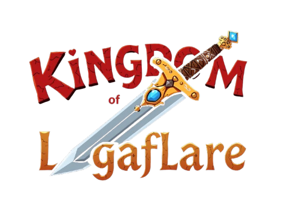

# Kingdom of LagaFlare - ETHOXFORD 2025

<div align="center">
  
</div>

## Overview

Kingdom of LagaFlare is a blockchain-based NFT card game where players can collect unique cards, battle against each other, and win their opponents' cards in combat.

## Features

- **NFT Card Minting**: Mint unique cards with different rarities and attack powers
- **Card Collection**: Build your deck with various cards featuring unique attributes
- **Battle System**: Challenge other players to card battles
- **Win or Lose**: Winner claims both cards after battle

## Card Rarities

- **Common**: Base attack power 100
- **Rare**: Base attack power 120
- **Epic**: Base attack power 150
- **Legendary**: Base attack power 200

## How to Play

1. **Connect Wallet**
   - Connect your MetaMask wallet to start playing
   - Make sure you're on the Flare Coston2 Testnet

2. **Get Your First Card**
   - Click "Open Pack" to mint your first NFT card
   - Each card has random rarity and attack power
   - Mint price: 0.01 Flare

3. **Battle System**
   - Select a card from your collection
   - Choose to either:
     - **Create Fight**: Start a new battle and share your Fight ID
     - **Join Fight**: Enter a Fight ID to join an existing battle
   
4. **Battle Resolution**
   - Battle outcome is determined by cards' attack powers
   - Higher attack power means better chance of winning
   - Winner receives both cards
   - Loser's card is transferred to the winner

## Technical Setup

```bash
# Install dependencies
npm install

# Start development server
npm run dev

# Build for production
npm run build
```

## Contract Address

C2FLARE Testnet: `0xd15927078676431351AE2f89e4639cD134B08104`

## Technologies Used

- React + Vite
- Ethers.js
- Material-UI
- Framer Motion
- Solidity
- OpenZeppelin
- Hardhat

## Tips for Success

1. Collect multiple cards to increase your chances of winning
2. Higher rarity cards have better base attack power
3. Keep track of your Fight ID when creating battles
4. Make sure you have enough C2 FLARE for minting and gas fees

## Experience with Flare

Building the game was a fantastic experience, despite facing some challenges with the Flare network—including a bug in the official contracts. Thankfully, the Flare team was incredibly responsive, resolving the issue within seconds. Their support was outstanding, and working with them was a pleasure. If it had been the Ethereum team, I probably would have waited a month!

The official documentation proved invaluable, providing everything I needed. Flare’s RNG is an exceptional feature—I only wish I had discovered it sooner, as it would have been perfect for my previous project. Though I found Flare a bit late, I’m glad I did. Overall, it was a fun and rewarding journey!

## License

MIT
